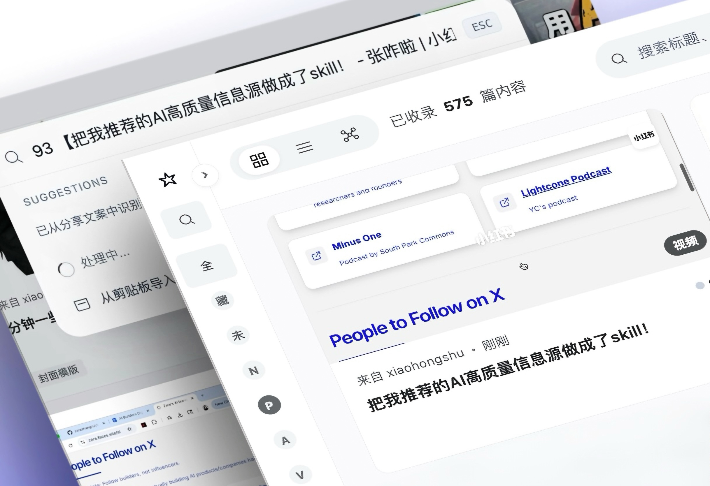
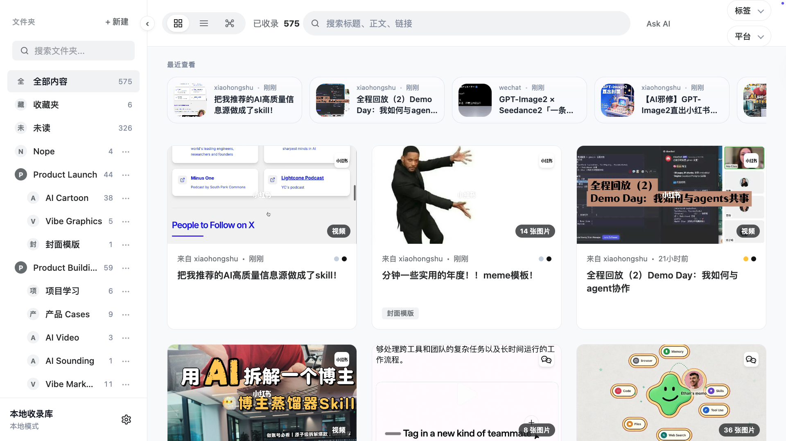
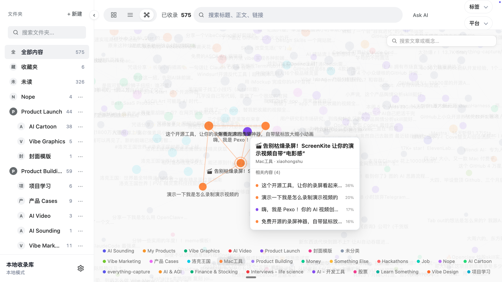
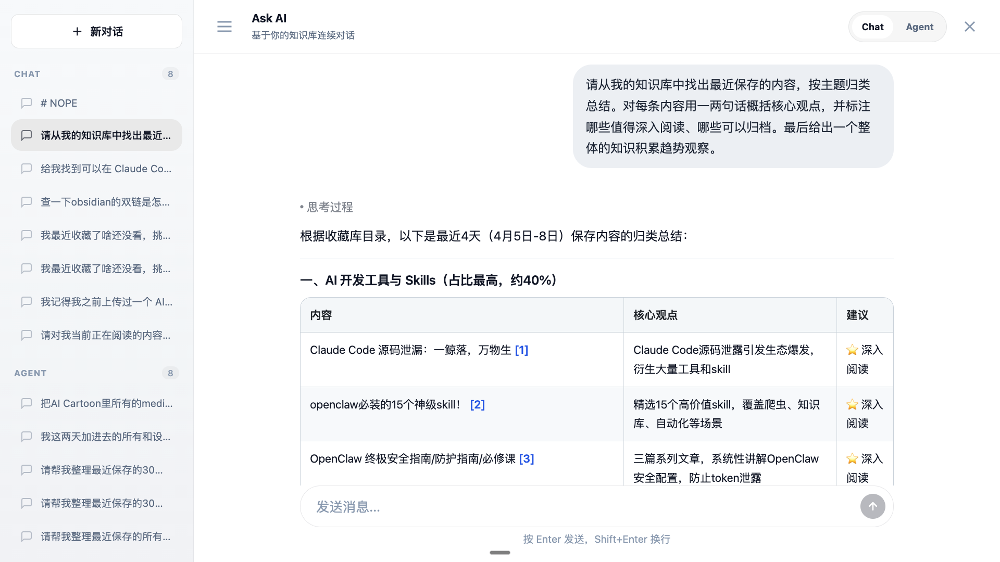
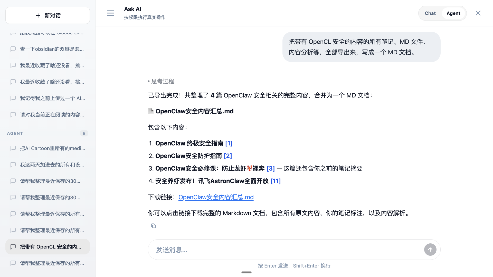
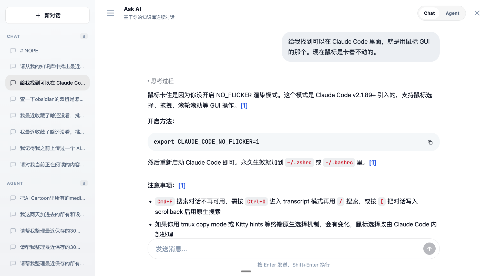

<div align="center">

# Everything Capture

**把网上看到的好东西，收进你自己的本地知识库**

看到一篇文章、一条帖子、一个视频，先丢进来。Everything Capture 会抓正文、存媒体、建索引，还能让 AI 帮你回看、总结和整理。重点是：数据放在你自己的电脑上。

[](https://python.org)
[](https://fastapi.tiangolo.com)
[](https://sqlite.org)
[](./LICENSE)
[](https://github.com/agentenatalie/everything-capture)
[](https://github.com/agentenatalie/everything-capture/stargazers)
[](https://github.com/agentenatalie/everything-capture/commits/main)

[English](./README_EN.md) · [项目主页](https://agentenatalie.github.io/everything-capture/)

</div>

<p align="center">
  
</p>

---

## 为什么做这个

我们每天都会遇到一堆“这个以后肯定有用”的东西。然后它们就散在浏览器收藏夹、聊天记录、截图、Notion、备忘录里。真要找的时候，只剩一句：“我记得我看过。”

Everything Capture 想解决的就是这件事：把链接、正文、图片、视频和笔记都收进一个本地库里。AI 助手查的是你电脑上的这份数据；Notion、Obsidian、云端收件箱都可以接上，但它们只是帮你同步或投递，不会替你保管全部家底。

## 核心功能

### 快捷采集

看到有用内容，不用先想该放哪个文件夹。复制链接、粘进 Web UI，或者用 `⌘K` 命令面板直接丢进去；手机上也可以通过自部署的云端收件箱，把链接投回你的本地机器。

后面的事交给它：识别链接、拉正文、存媒体、入库。你负责继续刷，它负责别让你忘。

<p align="center">
  
</p>

### 阅读与内容分析

普通网页、社交媒体帖子、小红书 / 抖音 / Twitter(X) / 微信公众号、图片和视频，都可以被整理成本地条目。

打开阅读器后，原文、媒体、解析内容、笔记和 AI 侧栏都在同一个工作区。读到一半突然想问“这段在讲什么”“帮我总结一下”“这跟我之前存的哪几篇有关”，可以直接问，不用再开一堆窗口。

<p align="center">
  
</p>

### 本地内容库

这不是一个把数据吞进云端黑盒的收藏夹。条目存在 SQLite 里，图片、视频、封面存在本地磁盘上。你可以按标题、正文、链接搜索，也可以叠加文件夹、标签和平台筛选。

中英文混着搜也可以。毕竟真实的资料库通常就是这样：中文笔记、英文标题、半截链接、几个你自己都快忘了为什么收藏的关键词。

<p align="center">
  
</p>

### 文件夹与关系图

文件夹可以多层嵌套，也可以拖拽整理。一个内容可以放进多个文件夹，父文件夹会统计整个子树里的内容数量。

如果你不想只看列表，也可以切到关系图。它会把文件夹、主题和相似内容连起来，让你看到“原来我最近一直在关注这个”。

<p align="center">
  
</p>

### AI 助手与 Agent

AI 助手默认读的是 Everything Capture 自己的本地数据库，不是某个云端文档的转存版。

你可以像这样问它：“我最近收藏的 AI Agent 资料里，有哪些值得认真看？”“帮我把 OpenCL 安全相关的内容整理成一份 Markdown。”“我之前存过那个 Claude Code 鼠标卡住的解决方法吗？”

Chat 模式适合问答、查找和总结。Agent 模式更像一个能动手的助手：整理文件夹、导出 Markdown、同步内容，或者在你授权后执行本地命令。

<table>
  <tr>
    <td width="50%">
      
      <br><strong>知识库总结</strong>
      <br>按主题检索本地条目，输出带引用的结构化结果。
    </td>
    <td width="50%">
      
      <br><strong>Agent 操作</strong>
      <br>整理内容、生成 Markdown、同步或执行需要你审批的本地命令。
    </td>
  </tr>
</table>

<p align="center">
  
</p>

### 更多能力

| | 功能 | 说明 |
|---|---|---|
| 🎙️ | **本地语音转录** | Apple Silicon 上可以用 mlx-whisper 在本机转录音视频 |
| 👁️ | **OCR 识别** | 用 macOS Vision 读图片里的文字，也能识别二维码 |
| 📤 | **可选同步 / 导出** | 可以推到 Notion 或 Obsidian，但它们只是出口，不是主仓库 |
| 📱 | **云端收件箱** | 自己部署一个轻量入口，手机和快捷指令就能往家里投链接 |
| 🖥️ | **桌面应用** | macOS .app 打包在做了，目标是像普通应用一样打开就用 |

## 快速开始

### 先跑起来

```bash
curl -O https://raw.githubusercontent.com/agentenatalie/everything-capture/main/setup.sh && bash setup.sh
```

这条命令会尽量把需要的东西都准备好：Python、ffmpeg、项目代码、依赖和本地服务。跑完之后就可以打开浏览器用了。

### 想自己一步步来

```bash
git clone https://github.com/agentenatalie/everything-capture.git
cd everything-capture
python3 -m venv backend/venv
backend/venv/bin/pip install -r requirements.txt
./run
```

然后访问 **http://localhost:8000**。

### 需要这些东西

| 依赖 | 用途 | 安装方式 |
|---|---|---|
| Python 3.11+ | 跑后端 | `brew install python3` / `apt install python3` |
| ffmpeg | 处理视频、音频和字幕 | `brew install ffmpeg` / `apt install ffmpeg` |
| Swift（macOS 自带） | 调 macOS Vision 做 OCR 和二维码识别 | `xcode-select --install` |

> `mlx` 和 `mlx-whisper` 只会在 Apple Silicon Mac 上安装。其他机器会自动跳过，不影响采集、搜索和阅读。

## 它大概怎么跑

```
桌面浏览器 / Web UI
    → backend/ (FastAPI :8000，顺手把 UI 和 API 都端出来)
    → ../everything-capture-data/app.db + media/

手机 / 分享菜单 / 快捷指令
    → 可选云端 capture_service/
    → 待处理队列
    → 本地 processing_worker 轮询提取
    → ../everything-capture-data/app.db + media/
```

日常使用时，本地后端负责主要工作。手机端如果要参与，只需要把链接丢到你自己部署的收件箱，本地 worker 会再把它拉回来处理。

## 项目结构

```
everything-capture/
├── backend/                FastAPI 后端：采集、解析、搜索、AI 都在这里
│   ├── routers/            API 路由：items, ingest, ai, folders, settings, connect
│   ├── services/           提取、下载、AI、知识库等具体逻辑
│   ├── models.py           数据模型
│   ├── database.py         数据库初始化、迁移和 FTS5 索引
│   └── main.py             后端入口
├── frontend/               无构建工具的 HTML/CSS/JS 单页应用
│   ├── index.html          页面入口
│   ├── css/index.css       样式
│   └── js/                 app-core, app-items, app-ai, app-folders 等
├── capture_service/        可选的云端收件箱，给手机和快捷指令用
├── desktop/                macOS 桌面版打包相关文件
│   ├── launcher/           桌面启动器，负责拉起和管理后端进程
│   ├── spec/               构建规格、manifest、签名配置
│   └── scripts/            构建、签名、公证、发布脚本
├── docs/                   项目主页
├── logo/                   SVG Logo 资源
├── setup.sh                一键安装脚本
├── run                     开发启动脚本（后端 + 前端 + worker）
└── requirements.txt        Python 依赖
```

## 数据放哪

默认情况下，数据不会塞进代码仓库，而是放在仓库旁边的 `everything-capture-data/`。这样你更新代码时，不会顺手把自己的资料库也折腾了。

```
../everything-capture-data/
├── app.db              SQLite 数据库（WAL 模式）
├── media/              下载的图片、视频、封面
├── .local/master.key   Fernet 加密主密钥
├── exports/            AI 沙盒导出文件
└── components/         已安装的可选组件
```

想换地方也可以，用这些环境变量改：`DATA_DIR`、`SQLITE_PATH`、`MEDIA_DIR`、`EXPORTS_DIR`。

AI 查资料时，主要看的就是这个本地 `app.db`。

## 文件夹怎么玩

- 文件夹可以一层套一层。
- 把一个文件夹拖到另一个文件夹上，它就会变成子文件夹。
- 拖到一行的上边缘或下边缘，可以在同级里调整顺序。
- 父文件夹显示的是整个子树里的唯一内容数，不只是直接放在它下面的内容。
- 点击顶层文件夹时，会同时选中它并展开 / 收起，不会再多塞一个小三角。

## 手机也能往里丢

如果你想在手机上分享链接到 Everything Capture，可以自己部署一个很轻的 `capture_service/`。它只负责收件，本地机器才负责真正解析内容。

```bash
backend/venv/bin/python scripts/prepare_capture_vercel_deploy.py ./deploy_output
cd deploy_output && vercel
```

然后在本地配置：

```bash
mkdir -p backend/.local
echo 'CAPTURE_SERVICE_URL="https://your-deployment.vercel.app"' > backend/.local/capture_service.env
```

之后运行 `./run`，本地 `processing_worker` 会自动去云端队列里取任务。

详见 [capture_service/README.md](./capture_service/README.md)。

## 接上你已经在用的工具

这些都可以在 Web UI 的设置页里配，不需要手动改配置文件。

| 集成 | 用途 |
|---|---|
| **Notion** | 把条目同步到 Notion 数据库，走 OAuth 授权 |
| **Obsidian** | 通过 Obsidian REST API 插件导出 Markdown |
| **AI**（OpenAI 兼容） | 用来问知识库、分析内容、自动整理 |

API 密钥会用 Fernet 加密后再存。

## AI 能干什么

内置 AI 助手有两种用法：

- **Chat 模式**：问知识库、总结内容、找你以前存过的东西。
- **Agent 模式**：在你授权后调用工具，比如搜索、整理文件夹、同步、导出、跑本地命令。

阅读器侧栏里的 AI 会自动使用 Agent 模式。你不用先想“这个问题需不需要工具”，它会自己判断。

系统命令比较敏感，所以每一条都要你手动确认。你会看到完整命令，点「允许」之后才会执行；执行完它还会读输出，再决定下一步。

它还会记住一些偏好，比如你常用的文件夹、关注的主题、喜欢的整理方式。你纠正过它的地方，它会尽量下次别再犯。

支持带 reasoning / 思维链标签的模型输出，也兼容 OpenAI、Claude、本地模型等 OpenAI 兼容 API。

## 常用环境变量

| 环境变量 | 默认值 | 说明 |
|---|---|---|
| `DATA_DIR` | `../everything-capture-data/` | 数据根目录 |
| `SQLITE_PATH` | `$DATA_DIR/app.db` | 数据库路径 |
| `MEDIA_DIR` | `$DATA_DIR/media/` | 媒体存储路径 |
| `CAPTURE_SERVICE_URL` | *（无）* | 云端采集服务地址 |
| `CAPTURE_SERVICE_TOKEN` | *（无）* | 采集服务认证 token |
| `RUN_RELOAD` | `1` | 启用 uvicorn 热重载 |
| `USE_FTS5_SEARCH` | `true` | 启用 FTS5 全文搜索 |
| `EVERYTHING_CAPTURE_FRONTEND_ORIGIN` | *（无）* | 反向代理或 OAuth 回调场景下的前端地址覆盖 |

## 开发和测试

```bash
# 运行后端测试
cd backend && source venv/bin/activate
PYTHONPATH="$(pwd)/..:$(pwd)" python -m pytest tests/ -v

# 运行 capture service 测试
PYTHONPATH="$(pwd)/.." python -m pytest ../capture_service/tests/ -v
```

## 许可证

这个仓库使用 [Elastic License 2.0](./LICENSE)（`Elastic-2.0`）。

简单说：你可以看代码、改代码、自己用；但不能直接拿它做托管服务、代运营服务或 SaaS 给第三方用。

如果你想做托管、SaaS、白标、OEM，或者其他超出 Elastic-2.0 的商业用途，需要单独拿商业授权。见 [COMMERCIAL-LICENSING.md](./COMMERCIAL-LICENSING.md)。

它是 source-available，不是 OSI 意义上的开源许可证。
